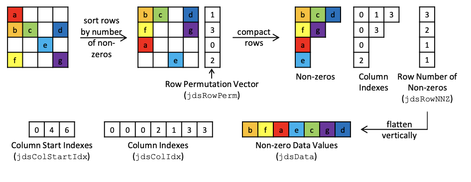

# Machine Problem 6: Sparse Matrix-Vector Multiplication

The purpose of this lab is to understand sparse matrix storage formats and
their impacts on performance, using sparse matrix-vector multiplication as an
example. The formats used in this lab are Compressed Sparse Row (CSR) and
Jagged Diagonal Storage (JDS).

The following figure illustrates the components of a JDS matrix and how it
is logically constructed.



## Running the code
```
make
. / spmv <m>       # Mode : m, Matrix 1000 x 1000
. / spmv <m> <n>   # Mode : m, Matrix i s n x n
```

For the mode option, select mode 1. There are 2 modes available for this lab:
* Mode 1 executes the CSR kernel
* Mode 2 executes the JDS kernel


